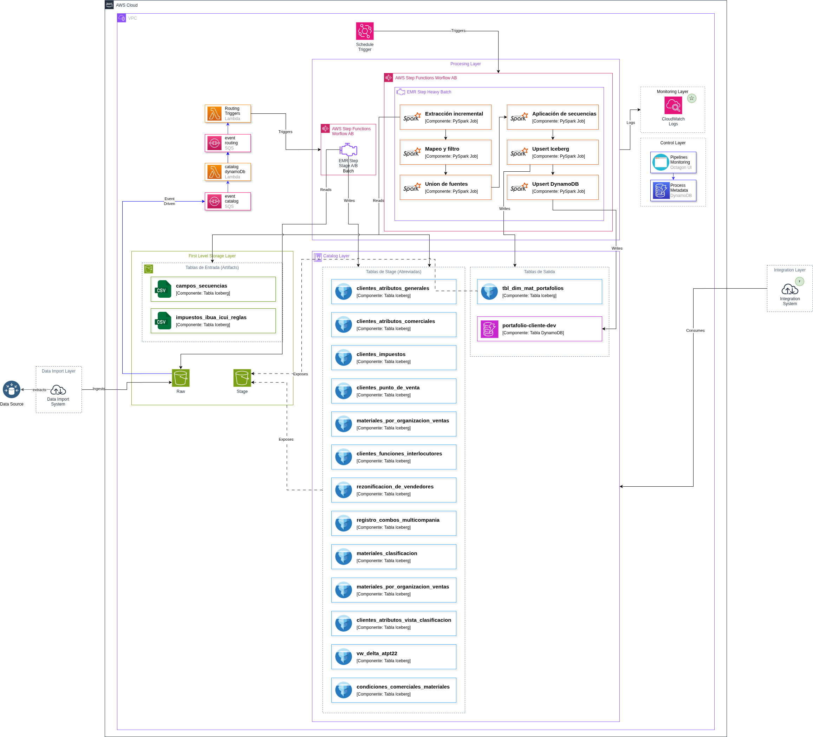

# Documento de Arquitectura de Datos

<!-- 
  Este documento describe la arquitectura de datos de un proyecto.
  Reemplaza las secciones marcadas con comentarios con información específica de tu proyecto.
-->

## Control de Cambios

| Versión | Fecha | Descripción del cambio | Elaborado por |
| :---- | :---- | :---- | :---- |
| 1.0 | YYYY-MM-DD | Versión inicial | [Nombre] |

<!-- 
  Agrega nuevas filas para cada versión del documento.
  Incluye fecha, descripción del cambio y autor.
-->

## Validación y Aprobación del Documento

| Fecha de aprobación | Aprobado por |
| :---- | :---- |
|  |  |

<!-- 
  Registra las fechas de aprobación y quién aprobó el documento.
-->

## Tabla de Contenido

1. [Introducción](#1-introducción)
2. [Descripción General del Proyecto](#2-descripción-general-del-proyecto)
3. [Objetivos de la Arquitectura de Datos](#3-objetivos-de-la-arquitectura-de-datos)
4. [Definición de Requisitos](#4-definición-de-requisitos)
5. [Descripción de la Arquitectura](#5-descripción-de-la-arquitectura)
6. [Seguridad y Cumplimiento](#6-seguridad-y-cumplimiento)
7. [Gestión y Monitoreo](#7-gestión-y-monitoreo)
8. [Costos y Optimización](#8-costos-y-optimización)
9. [Riesgos](#9-riesgos)
10. [Pruebas de Concepto](#10-pruebas-de-concepto)
11. [Cumplimiento de Estándares y Mejores Prácticas](#11-cumplimiento-de-estándares-y-mejores-prácticas)
12. [Cumplimiento de Requisitos](#12-cumplimiento-de-requisitos)
13. [Anexos](#13-anexos)

---

# 1. Introducción

<!-- 
  Esta sección debe incluir:
  - Propósito del documento
  - Alcance del documento
  - Audiencia objetivo (equipos técnicos, stakeholders, etc.)
  - Contexto del proyecto y su importancia
  - Cómo este documento ayuda a garantizar calidad, trazabilidad y gobernanza
-->

**Contenido sugerido:**
- Descripción del propósito del documento de arquitectura
- Contexto del proyecto y su importancia para la organización
- Cómo este documento sirve como referencia para equipos técnicos
- Relación con principios de gobernanza de datos y mejores prácticas (ITIL, etc.)

---

# 2. Descripción General del Proyecto

<!-- 
  Esta sección debe describir:
  - Qué problema resuelve el proyecto
  - Por qué es necesario
  - Contexto del negocio
  - Alcance (qué incluye y qué no)
  - Objetivos del proyecto
  - Beneficios esperados
-->

## 2.1. Contexto

<!-- 
  Describe el contexto del negocio:
  - Situación actual que motiva el proyecto
  - Limitaciones o problemas existentes
  - Necesidades del negocio que se buscan satisfacer
-->

## 2.2. Alcance

<!-- 
  Define claramente:
  - Qué está incluido en el proyecto
  - Qué está fuera del alcance
  - Limitaciones y supuestos
-->

## 2.3. Objetivos del Proyecto

<!-- 
  Lista los objetivos principales:
  - Objetivos de negocio
  - Objetivos técnicos
  - Objetivos de calidad de datos
-->

## 2.4. Beneficios Esperados

<!-- 
  Describe los beneficios que se esperan obtener:
  - Beneficios de negocio (eficiencia, reducción de costos, etc.)
  - Beneficios técnicos (escalabilidad, mantenibilidad, etc.)
  - Beneficios para usuarios finales
-->

---

# 3. Objetivos de la Arquitectura de Datos

<!-- 
  Esta sección debe establecer los objetivos arquitectónicos clave:
  - Consolidación de reglas de negocio
  - Escalabilidad del procesamiento
  - Trazabilidad de datos
  - Facilitar consumo y disponibilidad
  - Otros objetivos relevantes para el proyecto
-->

**Contenido sugerido:**
- Objetivos de consolidación y consistencia
- Objetivos de escalabilidad y rendimiento
- Objetivos de trazabilidad y auditoría
- Objetivos de disponibilidad y consumo de datos
- Alineación con mejores prácticas y estándares

---

# 4. Definición de Requisitos

<!-- 
  Esta sección debe documentar todos los requisitos funcionales y no funcionales
  que la arquitectura debe satisfacer.
-->

## 4.1. Requisitos Funcionales de la Arquitectura de Datos

<!-- 
  Describe los requisitos funcionales principales:
  - Ingesta desde múltiples fuentes
  - Transformaciones y filtros de datos
  - Cálculos y lógica de negocio
  - Almacenamiento y persistencia
  - Consultas y acceso a datos
  - Integraciones con otros sistemas
-->

### Ingesta desde Múltiples Fuentes

<!-- 
  Describe:
  - Qué fuentes de datos se deben ingerir
  - Formatos de datos soportados
  - Frecuencia de ingesta
  - Métodos de ingesta (batch, streaming, etc.)
-->

### Transformaciones y Filtro de Datos

<!-- 
  Describe:
  - Qué transformaciones se requieren
  - Reglas de validación y calidad
  - Filtros y criterios de inclusión/exclusión
  - Normalización y estandarización
-->

### Cálculo y Lógica de Negocio

<!-- 
  Describe:
  - Qué cálculos se deben realizar
  - Reglas de negocio a implementar
  - Agregaciones y consolidaciones
  - Enriquecimiento de datos
-->

### Almacenamiento y Consultas

<!-- 
  Describe:
  - Dónde se almacenan los datos procesados
  - Formatos de almacenamiento
  - Requisitos de consulta (latencia, concurrencia, etc.)
  - Patrones de acceso esperados
-->

## 4.2. Requisitos No Funcionales (Atributos de Calidad)

<!-- 
  Describe los atributos de calidad que la arquitectura debe cumplir:
  - Rendimiento
  - Escalabilidad
  - Mantenibilidad
  - Disponibilidad
  - Seguridad
  - Otros atributos relevantes
-->

### Rendimiento

<!-- 
  Define:
  - Tiempos de procesamiento esperados
  - Ventanas de ejecución
  - Latencia de consultas
  - Throughput requerido
-->

### Escalabilidad

<!-- 
  Define:
  - Cómo debe escalar la solución
  - Volúmenes de datos esperados
  - Crecimiento proyectado
  - Capacidad de incorporar nuevas fuentes
-->

### Mantenibilidad

<!-- 
  Define:
  - Estructura de código y modularidad
  - Configuración vs hardcoding
  - Separación de entornos
  - Documentación y conocimiento
-->

### Disponibilidad

<!-- 
  Define:
  - SLAs de disponibilidad
  - Tolerancia a fallos
  - Estrategias de recuperación
  - Redundancia y replicación
-->

### Seguridad

<!-- 
  Define:
  - Cifrado de datos (reposo y tránsito)
  - Control de acceso (IAM, permisos)
  - Cumplimiento normativo
  - Auditoría y logging
-->

---

# 5. Descripción de la Arquitectura

<!-- 
  Esta sección debe describir en detalle la arquitectura propuesta:
  - Diagramas de arquitectura
  - Componentes y servicios
  - Decisiones arquitectónicas
  - Flujos de datos
  - Orquestación
-->

## 5.1. Diagrama de Arquitectura de Datos Propuesta

<!-- 
  Incluye diagramas de arquitectura:
  - Diagrama de alto nivel
  - Diagrama de componentes
  - Diagrama de despliegue
  - Diagrama de flujo de datos
  
  Referencia los archivos de diagramas en docs/diagrams/
-->

<!-- 
  Reemplaza con tus diagramas:
  - components.png: Diagrama de componentes
  - containers.png: Diagrama de contenedores
  - deploy.png: Diagrama de despliegue
-->

## 5.2. Descripción de Componentes y Servicios

<!-- 
  Describe cada componente y servicio de la arquitectura:
  - Rol de cada componente
  - Responsabilidades
  - Tecnologías utilizadas
  - Interacciones entre componentes
-->

| Capa / Servicio | Rol en la Solución | Tecnología |
| ----- | ----- | ----- |
| [Capa/Servicio] | [Descripción del rol] | [Tecnología utilizada] |

<!-- 
  Completa la tabla con todos los componentes:
  - Almacenamiento (S3, DynamoDB, etc.)
  - Procesamiento (EMR, Glue, etc.)
  - Orquestación (Step Functions, Airflow, etc.)
  - Catálogo de datos (Glue Data Catalog, etc.)
  - Monitoreo (CloudWatch, etc.)
  - Otros servicios relevantes
-->

## 5.3. Arquitectura Seleccionada

<!-- 
  Documenta las decisiones arquitectónicas clave:
  - Qué opciones se evaluaron
  - Por qué se eligió cada componente
  - Trade-offs considerados
  - Justificación técnica y de negocio
-->

| Decisión Clave | Detalle de la Evaluación | Justificación |
| :---: | ----- | ----- |
| [Decisión] | [Opciones evaluadas] | [Por qué se eligió] |

<!-- 
  Documenta decisiones como:
  - Elección de servicios de procesamiento (EMR vs Glue vs otros)
  - Estrategia de almacenamiento (Iceberg vs Delta vs Parquet)
  - Patrones de orquestación (event-driven vs scheduled)
  - Estrategias de consumo (DynamoDB vs RDS vs otros)
  - Topología de clusters y recursos
  - Otros aspectos arquitectónicos relevantes
-->

## 5.4. Flujos de Datos y Procesos de la Arquitectura Escogida

<!-- 
  Describe el flujo completo de datos desde la ingesta hasta el consumo:
  - Pasos del pipeline
  - Transformaciones en cada etapa
  - Orden de ejecución
  - Dependencias entre procesos
-->

| # | Fase | Descripción (Alto Nivel) |
| :---: | :---: | ----- |
| 1 | [Fase] | [Descripción] |

<!-- 
  Documenta cada fase del pipeline:
  1. Ingesta de datos
  2. Validación y limpieza
  3. Transformaciones
  4. Cálculos de negocio
  5. Almacenamiento
  6. Consumo
  7. Otros pasos relevantes
-->

## 5.5. Orquestación en la Arquitectura

<!-- 
  Describe cómo se orquesta el pipeline:
  - Patrones de orquestación (event-driven, scheduled, híbrido)
  - Herramientas de orquestación
  - Flujos de trabajo
  - Manejo de errores y reintentos
  - Buenas prácticas aplicadas
-->

### Patrón de Orquestación

<!-- 
  Describe:
  - Qué patrón se usa (event-driven, scheduled, híbrido)
  - Por qué se eligió ese patrón
  - Cómo se implementa
-->

### Flujos de Trabajo

<!-- 
  Describe cada flujo de trabajo:
  - Workflow A: [Descripción]
  - Workflow B: [Descripción]
  - Interacciones entre workflows
-->

### Buenas Prácticas de Orquestación Aplicadas

<!-- 
  Lista las buenas prácticas:
  - Retries automáticos
  - Separación de responsabilidades
  - Principio de mínimo privilegio
  - Observabilidad centralizada
  - Otras prácticas relevantes
-->

---

# 6. Seguridad y Cumplimiento

<!-- 
  Esta sección debe documentar:
  - Medidas de seguridad implementadas
  - Políticas de cumplimiento
  - Estrategias de auditoría
-->

## 6.1. Medidas de Seguridad

<!-- 
  Describe las medidas de seguridad:
  - Cifrado de datos (reposo y tránsito)
  - Control de acceso (IAM, roles, políticas)
  - Principio de mínimo privilegio
  - Seguridad de red
  - Gestión de secretos
-->

### Cifrado

<!-- 
  Describe:
  - Cifrado en reposo (S3, DynamoDB, etc.)
  - Cifrado en tránsito (HTTPS, SSL/TLS)
  - Gestión de claves
-->

### Control de Acceso

<!-- 
  Describe:
  - Roles IAM y permisos
  - Políticas de acceso
  - Separación de entornos (dev, qa, prod)
  - Principio de mínimo privilegio aplicado
-->

## 6.2. Políticas de Cumplimiento y Privacidad de Datos

<!-- 
  Describe:
  - Políticas corporativas aplicadas
  - Cumplimiento normativo (GDPR, etc.)
  - Manejo de datos personales
  - Revisiones de seguridad
-->

## 6.3. Auditoría

<!-- 
  Describe las estrategias de auditoría:
  - Logging y trazabilidad
  - Registros de ejecución
  - Control de versiones de datos
  - CloudTrail y auditoría de acceso
  - Retención de logs
-->

---

# 7. Gestión y Monitoreo

<!-- 
  Esta sección debe documentar:
  - Roles y responsabilidades
  - Herramientas de gestión
  - Estrategias de monitoreo
  - Disponibilidad y rendimiento
-->

## 7.1. Roles y Responsabilidades

<!-- 
  Define los roles clave y sus responsabilidades:
  - Equipo de desarrollo/implementación
  - Equipo de operaciones/mantenimiento
  - Equipo de infraestructura/Cloud
  - Equipo de seguridad/DevSecOps
  - Gobierno de datos
  - Product Owner/Analista de negocio
-->

| Rol | Responsabilidades |
| :---: | ----- |
| [Rol] | [Responsabilidades] |

## 7.2. Herramientas y Estrategias de Gestión de Recursos

<!-- 
  Describe:
  - Herramientas utilizadas para gestión
  - Estrategias de optimización de recursos
  - Gestión de costos
  - Automatización de tareas operativas
-->

## 7.3. Soluciones de Monitoreo y Registro

<!-- 
  Describe:
  - Herramientas de monitoreo (CloudWatch, etc.)
  - Métricas clave a monitorear
  - Alertas y notificaciones
  - Dashboards y visualizaciones
  - Centralización de logs
-->

### Métricas Clave

<!-- 
  Lista las métricas importantes:
  - Métricas de procesamiento (duración, volumen, etc.)
  - Métricas de recursos (CPU, memoria, etc.)
  - Métricas de negocio (registros procesados, etc.)
  - Métricas de calidad (errores, validaciones, etc.)
-->

### Alertas y Notificaciones

<!-- 
  Describe:
  - Qué eventos generan alertas
  - Canales de notificación
  - Niveles de severidad
  - Runbooks asociados
-->

## 7.4. Disponibilidad y Rendimiento

<!-- 
  Describe:
  - Estrategias de alta disponibilidad
  - SLAs definidos
  - Tolerancia a fallos
  - Optimización de rendimiento
  - Plan de continuidad
-->

### Disponibilidad

<!-- 
  Describe:
  - Nivel de disponibilidad objetivo
  - Componentes HA vs no-HA
  - Estrategias de redundancia
  - Procedimientos de recuperación
-->

### Performance Tuning

<!-- 
  Describe:
  - Optimizaciones implementadas
  - Ajustes de configuración
  - Paralelismo y particionado
  - Caching y optimizaciones de lectura
-->

### Plan de Continuidad

<!-- 
  Describe:
  - Procedimientos de recuperación ante fallos
  - Estrategias de backup
  - Procedimientos de reproceso
  - Documentación operativa
-->

---

# 8. Costos y Optimización

<!-- 
  Esta sección debe documentar:
  - Estimación de costos
  - Optimizaciones implementadas
  - Estrategias de reducción de costos
-->

## 8.1. Estimación de Costos

<!-- 
  Proporciona:
  - Costo total estimado (mensual/anual)
  - Desglose por servicio/componente
  - Costos por ambiente (dev, qa, prod)
  - Supuestos y proyecciones
-->

| Componente | Costo Mensual Estimado | Justificación |
| :---: | :---: | :---: |
| [Componente] | [Costo] | [Justificación] |

## 8.2. Optimización y Mejoras Implementadas

<!-- 
  Describe las optimizaciones:
  - Reducción de intermediarios
  - Optimización de cómputo
  - Estrategias de almacenamiento
  - Gestión de ciclo de vida de datos
  - Otras optimizaciones
-->

### Optimización de Cómputo

<!-- 
  Describe:
  - Tipo de instancias seleccionadas
  - Topología de clusters
  - Estrategias de auto-scaling
  - Ventanas de uso
-->

### Optimización de Almacenamiento

<!-- 
  Describe:
  - Estrategias de almacenamiento (on-demand vs provisioned)
  - Compresión y formatos eficientes
  - Políticas de ciclo de vida
  - Eliminación de datos obsoletos
-->

---

# 9. Riesgos

<!-- 
  Esta sección debe documentar:
  - Riesgos identificados
  - Impacto potencial
  - Estrategias de mitigación
-->

| Riesgo | Impacto | Mitigación |
| :---: | :---: | ----- |
| [Riesgo] | [Impacto] | [Estrategias de mitigación] |

<!-- 
  Documenta riesgos como:
  - Fallos en provisionamiento de recursos
  - Ejecuciones colgadas o stuck
  - Problemas de sincronización de esquemas
  - Hot-keys o throttling
  - Pérdida de logs o métricas
  - Inconsistencias en datos
  - Datos corruptos en entrada
  - Otros riesgos relevantes
-->

---

# 10. Pruebas de Concepto

<!-- 
  Esta sección debe documentar:
  - Pruebas de concepto realizadas
  - Resultados y conclusiones
  - Viabilidad técnica
  - Decisiones basadas en POCs
-->

<!-- 
  Describe:
  - Qué POCs se realizaron
  - Tecnologías evaluadas
  - Resultados obtenidos
  - Conclusiones y decisiones tomadas
  - Referencias a documentación de POCs
-->

---

# 11. Cumplimiento de Estándares y Mejores Prácticas

<!-- 
  Esta sección debe documentar:
  - Estándares y frameworks seguidos
  - Mejores prácticas aplicadas
  - Alineación con marcos reconocidos
-->

## 11.1. Alineación con Frameworks de Arquitectura

<!-- 
  Describe alineación con:
  - SDLF (Serverless Data Lake Framework)
  - Well-Architected Framework de AWS
  - Otros frameworks relevantes
-->

## 11.2. Mejores Prácticas ITIL en Operación

<!-- 
  Describe aplicación de:
  - Gestión de Incidentes
  - Gestión de Cambios
  - Gestión de Problemas
  - Gestión de la Configuración
  - Servicio al usuario
-->

## 11.3. Pilares de Well-Architected Framework

<!-- 
  Describe cómo se cumplen los pilares:
  - Excelencia Operacional
  - Seguridad
  - Confiabilidad
  - Rendimiento
  - Optimización de Costos
-->

## 11.4. Mejores Prácticas Específicas de Servicios

<!-- 
  Describe mejores prácticas aplicadas para:
  - EMR
  - DynamoDB
  - Step Functions
  - S3
  - Otros servicios utilizados
-->

## 11.5. Gobierno de Datos y Calidad

<!-- 
  Describe:
  - Políticas de calidad de datos
  - Validaciones implementadas
  - Gobernanza de datos
  - Lineage y catálogos
-->

---

# 12. Cumplimiento de Requisitos

<!-- 
  Esta sección debe documentar:
  - Cómo se cumplen los requisitos definidos
  - Plan de pruebas
  - Plan de implementación
  - Matriz de trazabilidad requisitos-solución
-->

## 12.1. Plan de Pruebas Integrales

<!-- 
  Describe:
  - Estrategia de pruebas
  - Tipos de pruebas (unitarias, integración, sistema, etc.)
  - Criterios de aceptación
  - Referencia a documentación de pruebas
-->

## 12.2. Plan de Implementación

<!-- 
  Describe:
  - Fases de implementación
  - Entornos (dev, qa, prod)
  - Cronograma
  - Estrategia de despliegue
  - Referencia a documentación de implementación
-->

## 12.3. Matriz de Trazabilidad

<!-- 
  Proporciona matriz que relacione:
  - Requisitos funcionales
  - Requisitos no funcionales
  - Componentes de la solución
  - Pruebas que validan cada requisito
-->

---

# 13. Anexos

<!-- 
  Lista los anexos incluidos:
  - Anexo 1: [Descripción]
  - Anexo 2: [Descripción]
  - Anexo 3: [Descripción]
  - Anexo 4: [Descripción]
  - Otros anexos relevantes
-->

**Anexos comunes:**
- Anexo 1: Diagramas detallados
- Anexo 2: Matriz de riesgos
- Anexo 3: Documentación de POCs
- Anexo 4: Plan de pruebas e implementación
- Anexo 5: Glosario de términos
- Anexo 6: Referencias y estándares

---

<!-- 
  FIN DEL DOCUMENTO
  
  Recuerda:
  - Reemplazar todos los comentarios con contenido específico del proyecto
  - Actualizar la tabla de control de cambios
  - Completar todas las secciones marcadas
  - Incluir diagramas y referencias apropiadas
  - Mantener el documento actualizado durante el proyecto
-->
